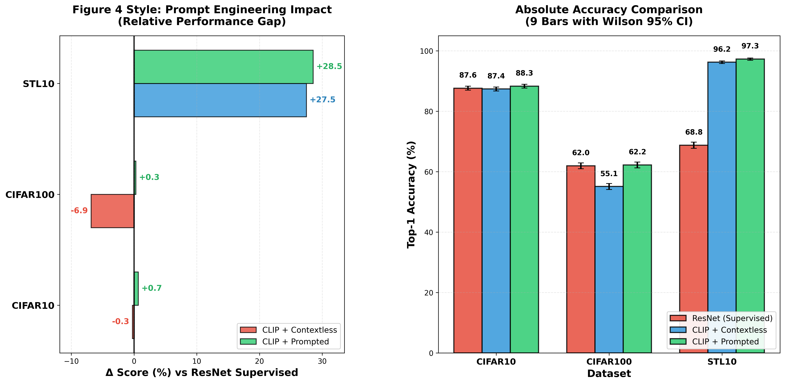
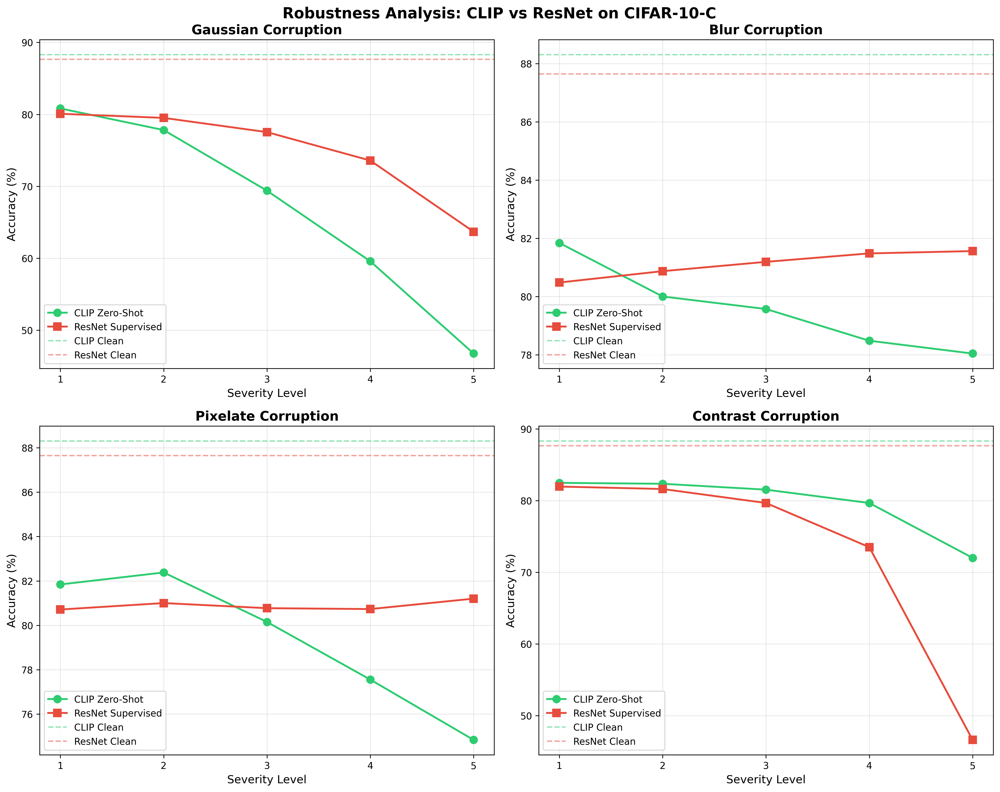
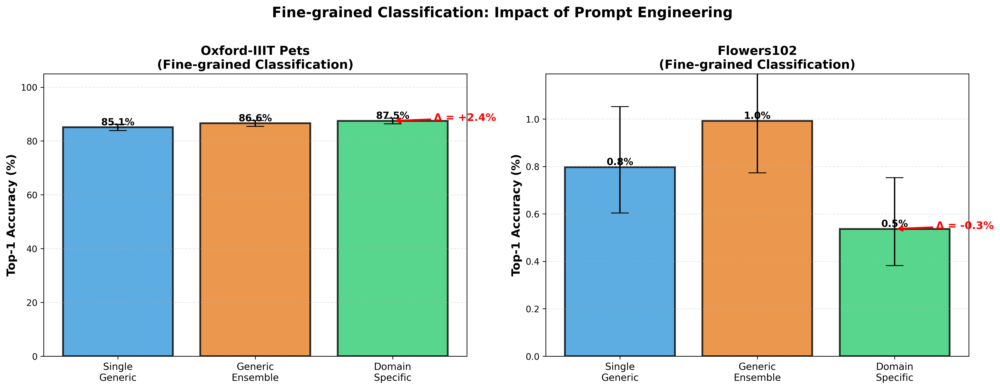

# CLIP Reproduction Experiments

Reproduction of core CLIP paper experiments on consumer hardware (RTX 5060 Laptop, 8 GB VRAM).

## Experiments

1. **Prompt Engineering** (Figure 4 style as the Clip Paper) — CIFAR-10 / CIFAR-100 / STL-10
2. **Robustness** — CIFAR-10-C synthetic corruptions (Gaussian, Blur, Pixelate, Contrast)
3. **Fine-grained Classification** — Oxford-IIIT Pets & Flowers-102 with domain-specific prompts

## Quick Start

### One-Click Full Pipeline (Recommended)
`main.py` automatically detects missing ResNet baselines and trains them on demand before running evaluations

# 1. Install dependencies
pip install -r requirements.txt

# 2. Run the full pipeline
 `main.py`

# Or run modules independently
 `train_resnet.py` --dataset CIFAR10 --epochs 30

 `eval_prompt.py`

 `eval_robustness.py`

 `eval_finegrained.py`

### Prompt Engineering Results (Wilson 95% CI)

| Dataset   | Method              | Top-1 Accuracy | 95% CI           | Δ vs ResNet | Top-5 Accuracy |
|-----------|---------------------|----------------|------------------|-------------|----------------|
| CIFAR-10  | ResNet (Supervised) | 87.65%         | [86.99, 88.28]   | —           | 99.36%         |
|           | CLIP + Contextless  | 87.38%         | [86.71, 88.02]   | -0.27%      | 99.16%         |
|           | CLIP + Prompted     | 88.31%         | [87.67, 88.93]   | +0.66%      | 99.24%         |
| CIFAR-100 | ResNet (Supervised) | 61.95%         | [60.99, 62.90]   | —           | 86.86%         |
|           | CLIP + Contextless  | 55.10%         | [54.12, 56.07]   | -6.85%      | 81.32%         |
|           | CLIP + Prompted     | 62.24%         | [61.29, 63.19]   | +0.29%      | 87.00%         |
| STL-10    | ResNet (Supervised) | 68.76%         | [67.74, 69.77]   | —           | 97.30%         |
|           | CLIP + Contextless  | 96.24%         | [95.80, 96.63]   | +27.47%     | 99.90%         |
|           | CLIP + Prompted     | 97.29%         | [96.91, 97.62]   | +28.52%     | 99.98%         |

# Prompt Engineering (Figure 4 Reproduction)

### Robustness Metrics Summary  
*Effective Robustness = Acccorrupted / Accclean*

| Corruption | CLIP  | ResNet | CLIP Advantage |
|------------|-------|--------|----------------|
| Gaussian   | 0.757 | 0.854  | -0.097         |
| Blur       | 0.901 | 0.925  | -0.024         |
| Pixelate   | 0.899 | 0.923  | -0.024         |
| Contrast   | 0.901 | 0.829  | +0.072         |
| **Average**| **0.865** | **0.883** | **-0.018** |

# Robustness Analysis

### Fine-grained Classification Results

| Dataset          | Strategy         | Top-1 Acc (%) | Mean Per-Class Acc (%) |
|------------------|------------------|---------------|------------------------|
| Oxford-IIIT Pets | Single Generic   | 85.09         | 84.75                  |
|                  | Generic Ensemble | 86.56         | 86.22                  |
|                  | Domain Specific  | 87.46         | 87.14                  |
| Flowers-102      | Single Generic   | 0.80          | 0.78                   |
|                  | Generic Ensemble | 0.99          | 1.24                   |
|                  | Domain Specific  | 0.54          | 1.00                   |

# Fine-grained Classification

Note: Flowers-102 accuracy appears unusually low. This is likely due to a class-name mismatch between the dataset labels and the CLIP text prompts. Consider verifying classnames in eval_finegrained.py.

